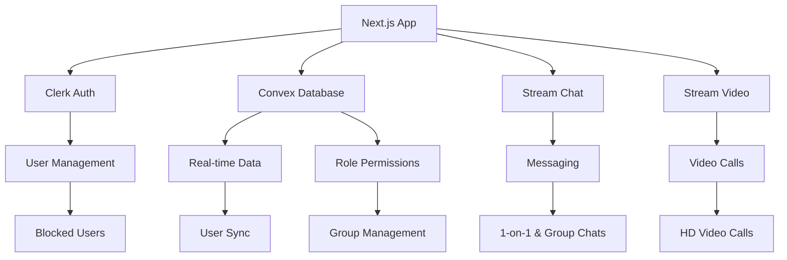
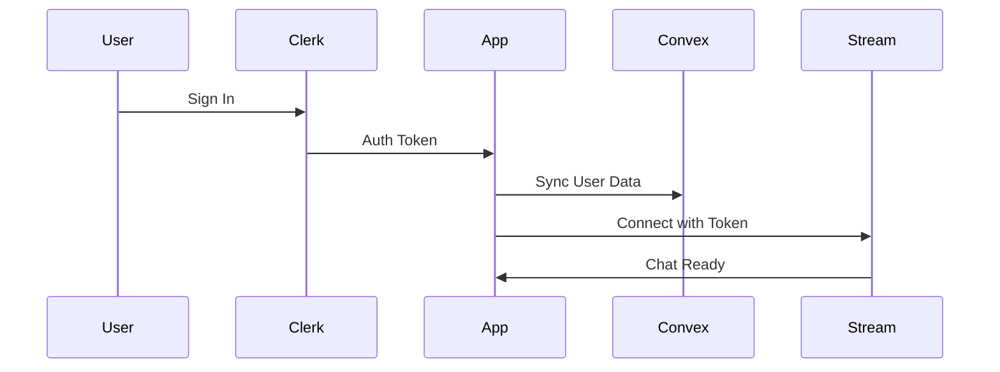
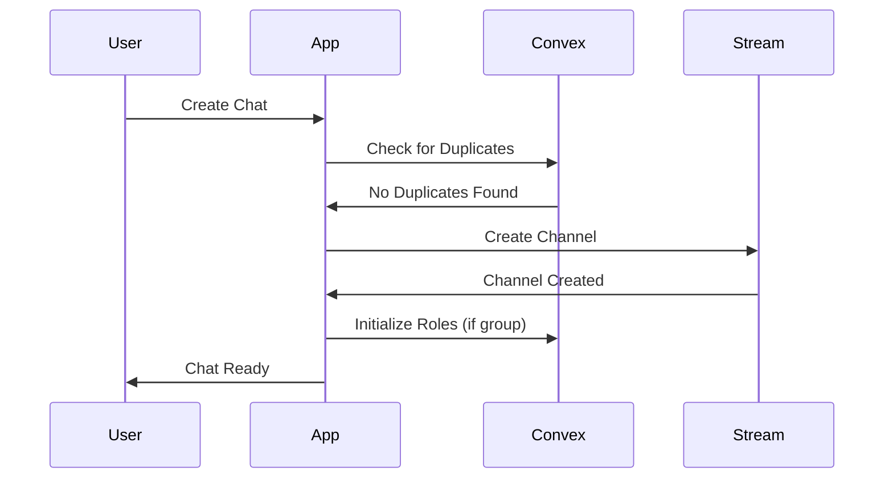
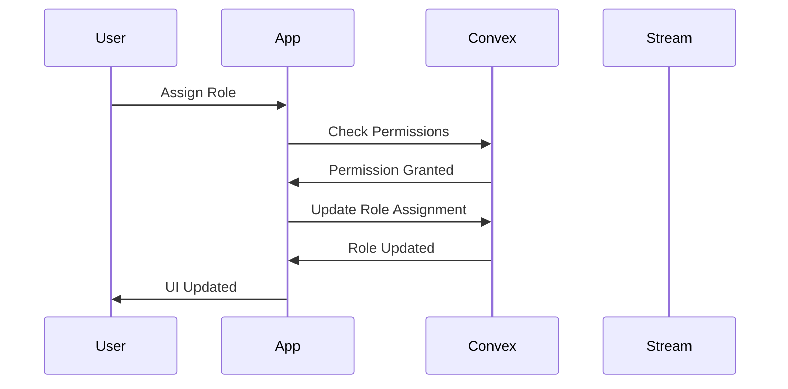

# 🚀 Grouplyy

> **Modern team collaboration platform** with real-time messaging, HD video calls, and advanced group management powered by role-based permissions.

[](https://nextjs.org/)
[](https://www.typescriptlang.org/)
[](https://getstream.io/)
[](https://clerk.com/)
[](https://convex.dev/)

## ✨ Features

### 💬 **Real-Time Messaging**
- **Instant messaging** with Stream Chat integration
- **1-on-1 and group chats** with duplicate detection
- **Modern glassmorphism UI** with floating sidebar
- **Real-time message sync** across all devices

### 🎥 **HD Video Calling**
- **One-click video calls** from any chat channel
- **HD video quality** powered by Stream Video
- **Connection state handling** and invite link sharing
- **Mobile-responsive** video interface

### 👥 **Advanced Group Management**
- **Role-based permission system** with custom roles
- **8 granular permissions** (send messages, invite members, kick members, etc.)
- **Custom role creation** with specific permission sets
- **Real-time permission enforcement** across all actions
- **Member management** with role assignment and kicking

### 🔒 **User Management & Security**
- **Comprehensive blocking system** with Convex persistence
- **Blocked users filtering** from search and chat creation
- **Permission-based UI** that shows/hides features based on user roles
- **Secure authentication** with Clerk integration

### 🎨 **Modern UI/UX**
- **Glassmorphism design** with backdrop blur effects
- **Responsive layout** for desktop and mobile
- **Context-aware menus** with permission-based options
- **Accessibility support** with proper ARIA labels

## 🛠️ Tech Stack

| Category | Technology | Purpose |
|----------|------------|---------|
| **Frontend** | Next.js 15 (App Router) | React framework with server-side rendering |
| **Language** | TypeScript 5.0 | Type-safe JavaScript development |
| **UI Framework** | React 19 | Component-based UI library |
| **Styling** | Tailwind CSS 4 | Utility-first CSS framework |
| **Authentication** | Clerk | User management and authentication |
| **Database** | Convex | Real-time serverless database |
| **Real-time Chat** | Stream Chat | Messaging and chat functionality |
| **Video Calling** | Stream Video | HD video calling capabilities |
| **UI Components** | Shadcn/ui | Accessible component library |

## 🏗️ Architecture



## 🚀 Quick Start

### Prerequisites
- **Node.js** 18+ 
- **npm** or **yarn** package manager
- **Git** for version control

### Required Services
| Service | Purpose | Setup Required |
|---------|---------|----------------|
| [Clerk](https://clerk.com/) | Authentication | Frontend API key |
| [Convex](https://convex.dev/) | Database | Deployment URL |
| [Stream](https://getstream.io/) | Chat & Video | API key + secret |

### 1️⃣ Clone & Install
```bash
git clone https://github.com/yourusername/Grouplyy.git
cd Grouplyy
npm install
```

### 2️⃣ Environment Setup
Create `.env.local` in the project root:

```bash
# 🔐 Authentication (Clerk)
NEXT_PUBLIC_CLERK_FRONTEND_API_KEY="pk_test_..."

# 🗄️ Database (Convex)
NEXT_PUBLIC_CONVEX_URL="https://your-deployment.convex.cloud"

# 💬 Real-time Services (Stream)
NEXT_PUBLIC_STREAM_API_KEY="your-public-key"
STREAM_API_SECRET_KEY="your-secret-key"
```

> ⚠️ **Security Note**: Never expose `STREAM_API_SECRET_KEY` client-side. It's only used server-side for token minting.

### 3️⃣ Run Development Server
```bash
npm run dev
```

Open [http://localhost:3000](http://localhost:3000) in your browser.

### 4️⃣ First-Time Setup
1. **Sign In** → Click "Sign In" on the landing page
2. **Dashboard** → You'll be redirected to `/dashboard`
3. **Auto-Setup** → App automatically:
   - Syncs your profile to Convex
   - Connects to Stream Chat with secure token
4. **Start Chatting** → Click "Start New Chat" to create conversations
5. **Video Calls** → Click "Video Call" in any chat for HD video

## 🎯 Key Features Walkthrough

### 💬 **Creating Chats**
- **1-on-1**: Search users and start private conversations
- **Group Chats**: Add multiple members and set group names
- **Duplicate Prevention**: Automatic detection of existing 1-on-1 chats

### 👥 **Group Management**
- **Role System**: Create custom roles with specific permissions
- **Member Control**: Invite, kick, and assign roles to members
- **Permission Enforcement**: UI adapts based on your role permissions

### 🔒 **User Blocking**
- **Block Users**: Block unwanted users from the sidebar menu
- **Filtered Experience**: Blocked users are hidden from search and chats
- **Management**: View and unblock users from the dedicated page

### 🎥 **Video Calling**
- **One-Click**: Start video calls directly from any chat
- **HD Quality**: Powered by Stream Video for crystal-clear calls
- **Share Links**: Copy invite links to bring others into calls

## 📁 Project Structure

```
Grouplyy/
├── 📱 app/                          # Next.js App Router
│   ├── (signed-in)/                # Authenticated routes
│   │   ├── dashboard/              # Main chat interface
│   │   │   ├── blocked/           # Blocked users management
│   │   │   └── video-call/[id]/   # Video calling interface
│   │   └── layout.tsx             # Auth layout with providers
│   ├── globals.css                 # Global styles
│   └── layout.tsx                 # Root layout
├── 🧩 components/                   # React components
│   ├── ui/                        # Shadcn/ui components
│   ├── app-sidebar.tsx            # Main sidebar with role management
│   ├── NewChatDialog.tsx          # Chat creation dialog
│   └── UserSearch.tsx             # User search with filtering
├── 🗄️ convex/                      # Convex backend
│   ├── schema.ts                  # Database schema
│   ├── users.ts                   # User & role management functions
│   └── auth.config.ts             # Clerk integration
├── 🎣 hooks/                       # Custom React hooks
│   ├── useCreateChatClient.ts     # Chat creation logic
│   └── useUserSearch.ts           # Debounced user search
├── 📚 lib/                         # Utility libraries
│   ├── stream.ts                  # Stream Chat client
│   └── streamServer.ts            # Server-side Stream setup
├── ⚡ actions/                     # Server actions
│   └── createToken.ts             # Stream token generation
└── 🔧 Configuration files
```

## 🔄 Key Flows

### 🔐 Authentication Flow


### 💬 Chat Creation Flow


### 👥 Role Management Flow


## 🚀 Deployment

### Environment Variables
Configure these in your hosting provider:

| Variable | Description | Required |
|----------|-------------|----------|
| `NEXT_PUBLIC_CLERK_FRONTEND_API_KEY` | Clerk authentication key | ✅ |
| `NEXT_PUBLIC_CONVEX_URL` | Convex deployment URL | ✅ |
| `NEXT_PUBLIC_STREAM_API_KEY` | Stream public API key | ✅ |
| `STREAM_API_SECRET_KEY` | Stream secret key (server-only) | ✅ |

### Deployment Platforms
- **Vercel** (Recommended) - One-click deployment
- **Netlify** - Static site hosting
- **Railway** - Full-stack deployment
- **Docker** - Container deployment

### Build Commands
```bash
# Development
npm run dev

# Production Build
npm run build

# Start Production Server
npm run start
```

## 🤝 Contributing

We welcome contributions! Here's how to get started:

### 1. Fork & Clone
```bash
git clone https://github.com/yourusername/Grouplyy.git
cd Grouplyy
```

### 2. Create Feature Branch
```bash
git checkout -b feature/amazing-feature
```

### 3. Make Changes
- Follow the existing code style
- Add tests for new features
- Update documentation as needed

### 4. Test Locally
```bash
npm run dev
# Test all features: chat, video, roles, blocking
```

### 5. Submit Pull Request
- Describe your changes clearly
- Reference any related issues
- Ensure all tests pass

## 📋 Development Guidelines

### Code Style
- Use TypeScript for type safety
- Follow React best practices
- Use Tailwind CSS for styling
- Implement proper error handling

### Testing
- Test chat creation and messaging
- Verify role permissions work correctly
- Test video calling functionality
- Check blocking system behavior

## 📄 License

This project is licensed under the **MIT License** - see the [LICENSE](LICENSE) file for details.

## 🙏 Acknowledgments

- [Next.js](https://nextjs.org/) - React framework
- [Clerk](https://clerk.com/) - Authentication
- [Convex](https://convex.dev/) - Real-time database
- [Stream](https://getstream.io/) - Chat and video
- [Shadcn/ui](https://ui.shadcn.com/) - UI components

---

📖 **For detailed technical documentation, see [CONTEXT.md](CONTEXT.md)**
